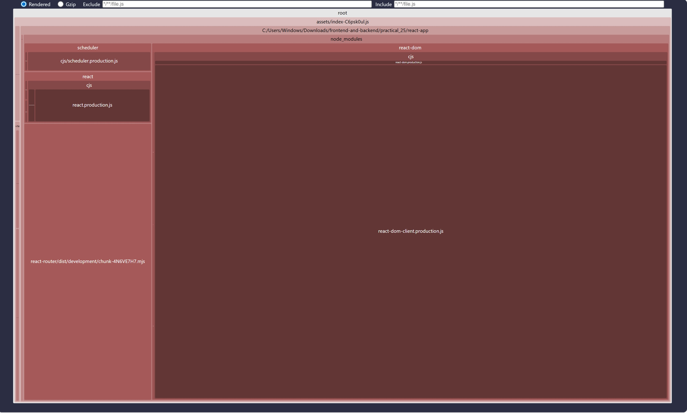

# Практическое задание №25: Инструменты сборки: Webpack и Vite

В данной практической работе рассмотрены современные инструменты сборки фронтенд-приложений — Webpack и Vite, их ключевые отличия, а также техники оптимизации бандла: code splitting, tree shaking, lazy loading и анализ зависимостей.

Ниже приведён скриншот bundle-репорта собранного проекта:

