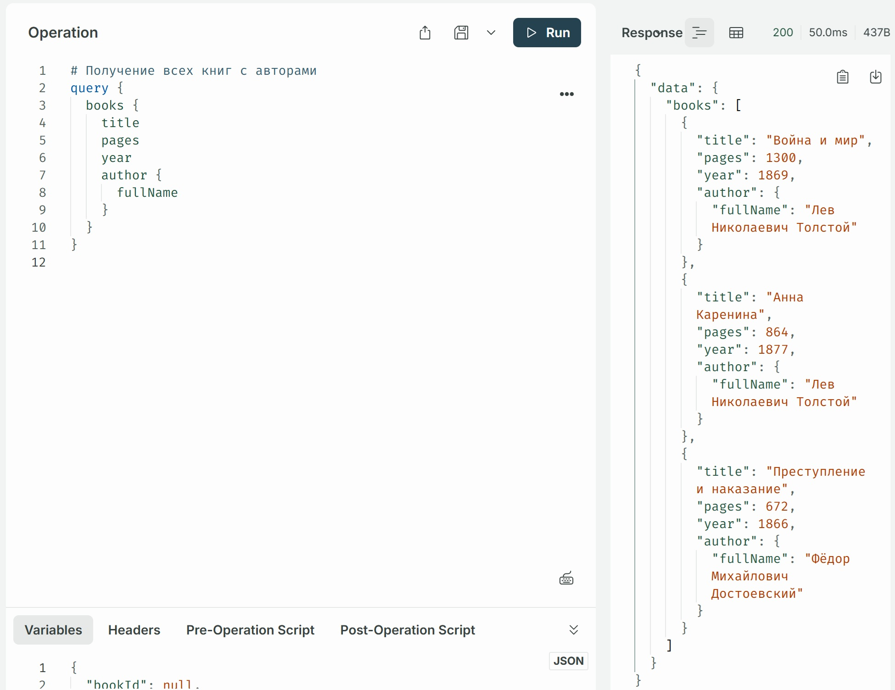
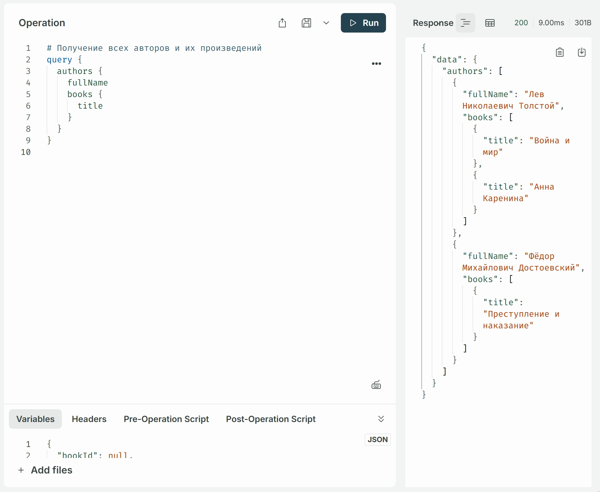
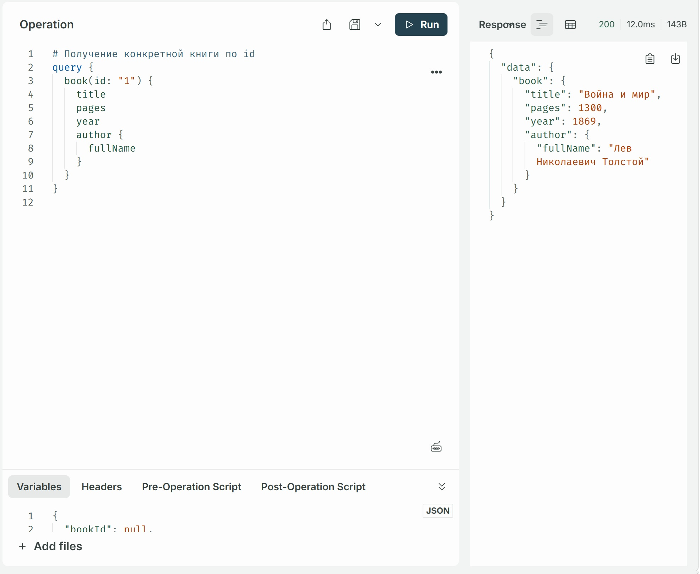
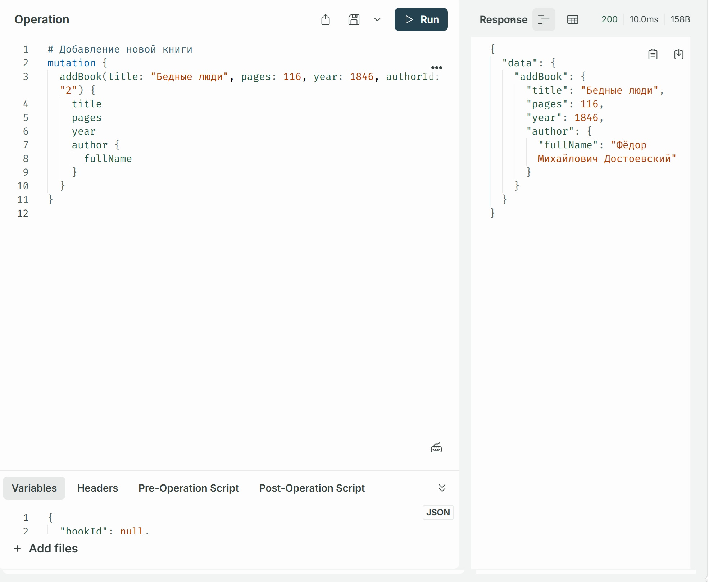
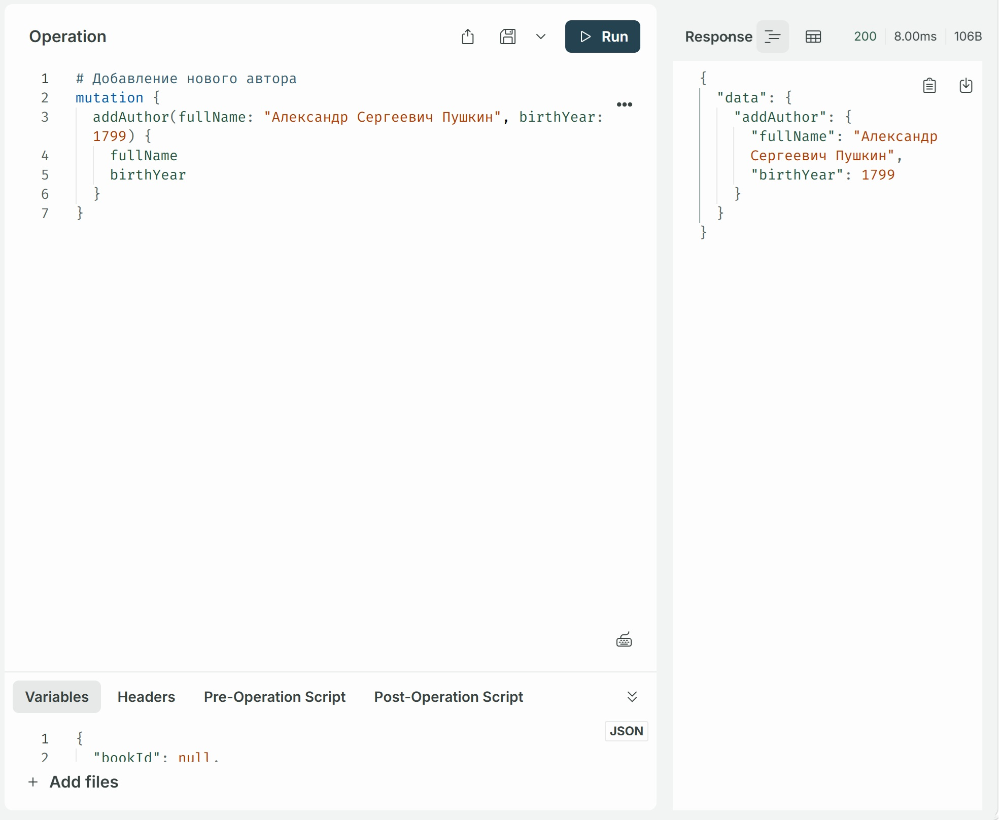

# Практическое задание №26: GraphQL и Apollo

В данной практической работе рассмотрена парадигма GraphQL как альтернатива REST. Помимо этого рассмотрена система типов и схем, создание серверной части с Apollo Server, а также подписки (subscriptions) для работы в реальном времени.

Ниже приведены скриншоты демонстрационных запросов с помощью Apollo Sandbox:

## Получение всех книг с авторами

## Получение всех авторов и их произведений

## Получение конкретной книги по id

## Добавление новой книги

## Добавление нового автора

