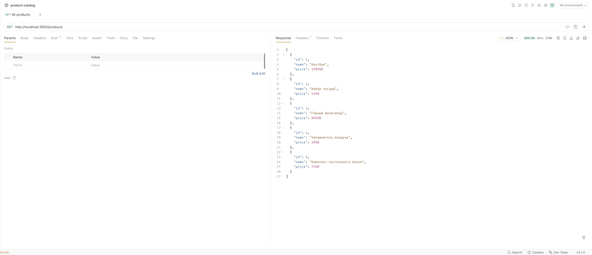
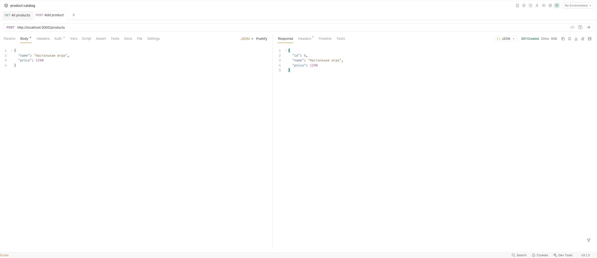
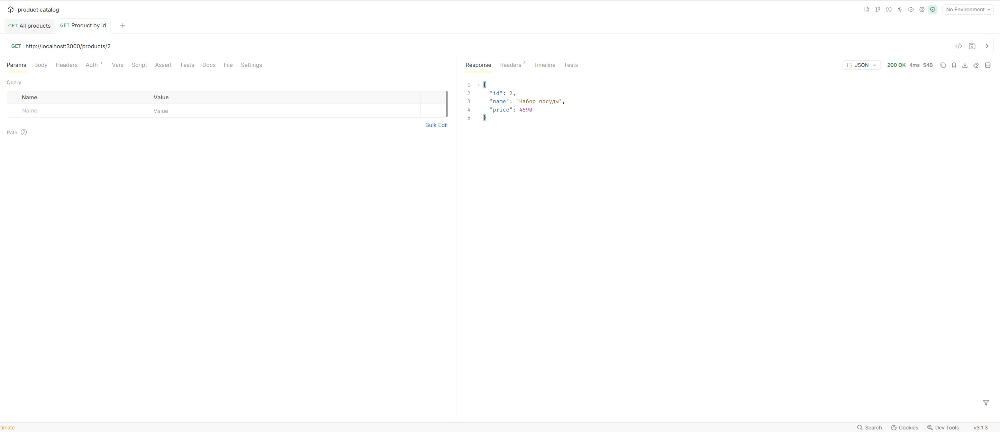
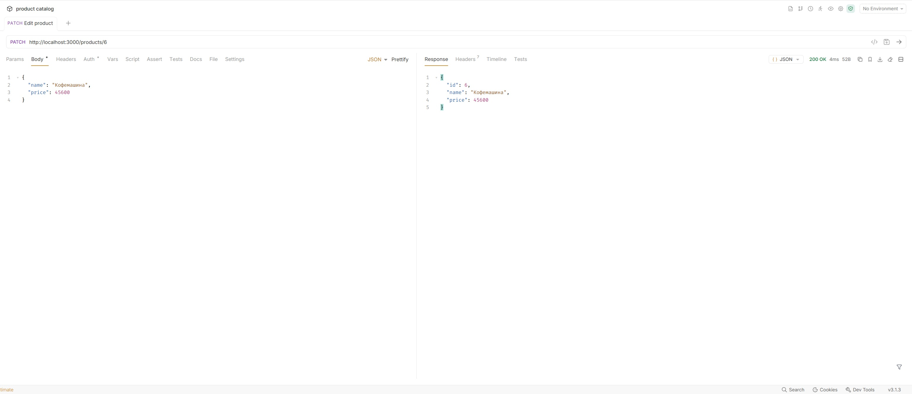
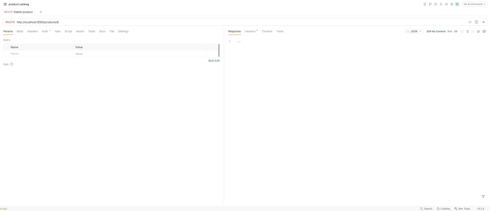
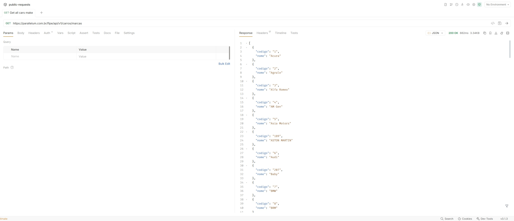
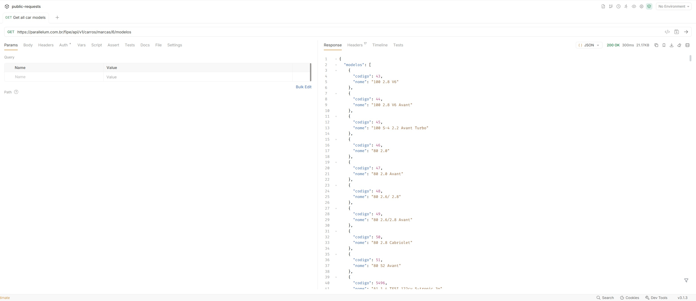
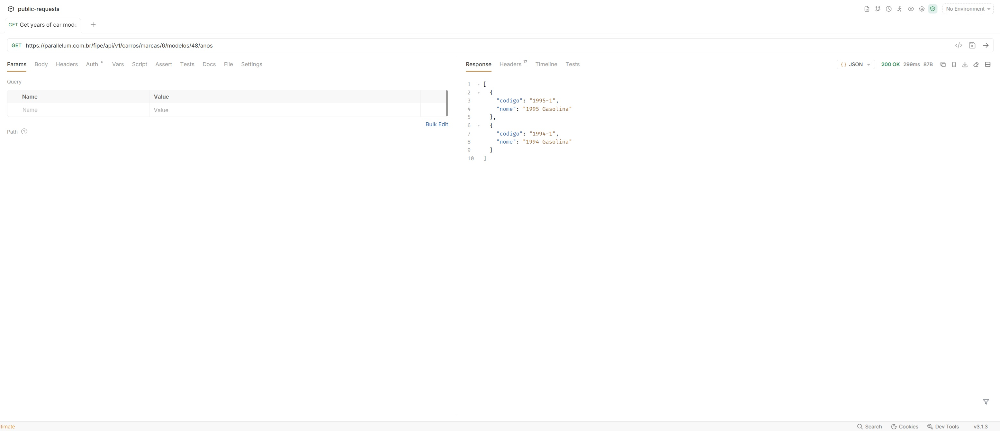
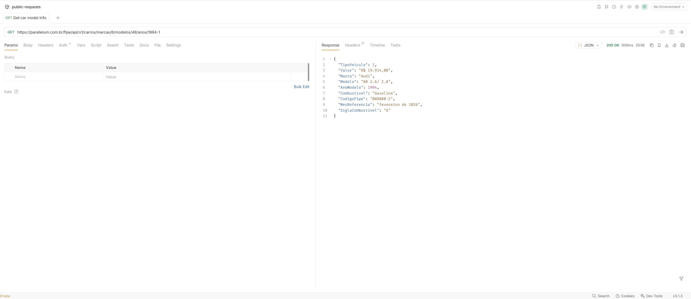
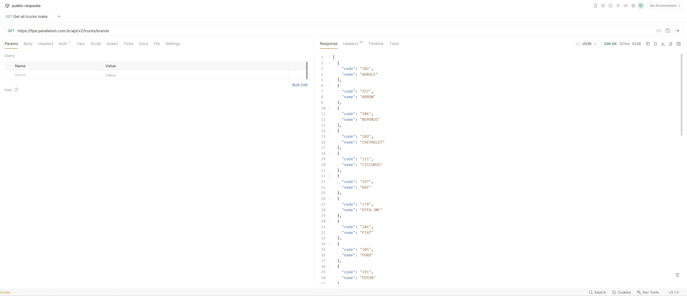

# Практическое задание №3: JSON и внешние API

В данной практической работе рассмотрена работа с API и её структурой, а также парсинг JSON. Тестирование API осуществляется с помощью **Bruno**.

## API из [Практической работы №2](../practical_2/)

### 1. Получение всех товаров

### 2. Добавление нового товара

### 3. Получение конкретного товара по его ID

### 4. Редактирование товара по его ID

### 5. Удаление товара по его ID

## [Открытое API](https://deividfortuna.github.io/fipe/) с транспортом из Бразилии

### 1. Получение всех марок машин

### 2. Получение всех моделей машины определённой марки

### 3. Получение всех годов выпуска определённой модели

### 4. Получение информации о конкретной модели машины и её цене

### 5. Получение всех марок грузовиков

